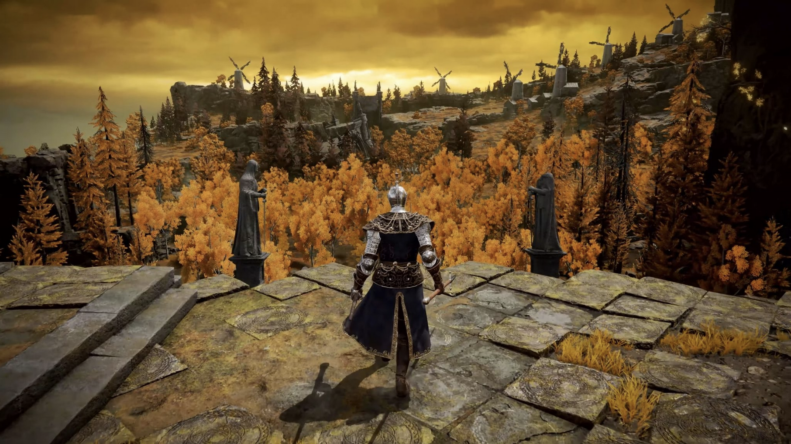

1. My favorite game is Elden Ring. The art and cryptic story is very interesting and beautiful. I also think that making a game very hard makes winning it all the more rewarding. Everything in it from the movement to the sound design is designed to make it feel highly aggresive and real, giving an honest stress reaction. I also like how it corrals you into various play styles and encourages glass cannon playstyles, with many things that can power you up also having downsides.
2. Elden Ring is made by FromSoftware [https://www.fromsoftware.jp/ww/]
3. Elden Ring's release date was February 25, 2022
4. I've read that Elden Ring was made with FromSoft's own in house game engine which I believe is called Dantellion?
5. 
6. Dark Souls [https://store.steampowered.com/agecheck/app/570940/], Darks Souls 3 [https://store.steampowered.com/agecheck/app/374320/], Armored Core 6 [https://en.bandainamcoent.eu/armored-core/armored-core-vi-fires-of-rubicon]